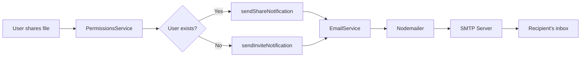

# 📧 Email Notification System - Setup Guide

## Overview

VReal now has a **professional email notification system** that automatically sends emails when:
- 📤 Files/folders are shared with users
- 🔄 Permission levels are changed
- ❌ Access is revoked
- 🎉 New users are invited to the platform

## Features

✨ **Beautiful HTML Emails** - Professional, responsive design
🎨 **4 Email Templates** - Share, Invite, Permission Changed, Access Revoked
🚀 **Automatic Sending** - Triggered by sharing actions
📊 **Non-blocking** - Email failures don't break the app
🔧 **Configurable** - Works with Gmail, SendGrid, Mailgun, etc.

---

## 🛠️ Quick Setup

### 1. Configure Environment Variables

Add these to your `.env` file:

```env
# Email Configuration
EMAIL_HOST=smtp.gmail.com
EMAIL_PORT=587
EMAIL_SECURE=false
EMAIL_USER=your-email@gmail.com
EMAIL_PASSWORD=your-app-password
EMAIL_FROM=noreply@vreal.com
EMAIL_FROM_NAME=VReal
```

### 2. Gmail Setup (Recommended for Testing)

**Step 1:** Enable 2-Factor Authentication
1. Go to https://myaccount.google.com/security
2. Enable 2-Step Verification

**Step 2:** Create App Password
1. Visit https://myaccount.google.com/apppasswords
2. Select **App:** Mail
3. Select **Device:** Other (Custom name) - type "VReal"
4. Click **Generate**
5. Copy the 16-character password (e.g., `abcd efgh ijkl mnop`)

**Step 3:** Update `.env`
```env
EMAIL_USER=your-gmail@gmail.com
EMAIL_PASSWORD=abcd efgh ijkl mnop
```

### 3. Test Email Sending

Start the server and share a file:

```bash
npm run start:dev
```

Then use the frontend or API to share a file/folder with another email address.

---

## 📬 Email Types

### 1. **Share Notification**
Sent when you share a file/folder with an **existing user**.

**Includes:**
- Resource name and type
- Permission level granted
- Direct access button
- Beautiful gradient header (purple)

### 2. **Invite Notification**
Sent when you share with a **non-registered email**.

**Includes:**
- Invitation to join VReal
- Resource preview
- "Create Account" button
- Feature highlights
- Colorful gradient header (pink/orange)

### 3. **Permission Changed**
Sent when you **update** someone's permission level.

**Includes:**
- Old permission → New permission
- What the new permission allows
- Visual before/after display
- Green gradient header

### 4. **Access Revoked**
Sent when you **remove** someone's access.

**Includes:**
- Notification of revoked access
- Resource details
- Link to their dashboard
- Warning message
- Yellow/orange gradient

---

## 🔧 Alternative SMTP Providers

### SendGrid (Production Recommended)

```env
EMAIL_HOST=smtp.sendgrid.net
EMAIL_PORT=587
EMAIL_USER=apikey
EMAIL_PASSWORD=YOUR_SENDGRID_API_KEY
EMAIL_FROM=verified-email@yourdomain.com
EMAIL_FROM_NAME=VReal
```

**Setup:**
1. Sign up at https://sendgrid.com
2. Create an API key
3. Verify your sender email/domain
4. Use API key as password

### Mailgun

```env
EMAIL_HOST=smtp.mailgun.org
EMAIL_PORT=587
EMAIL_USER=postmaster@your-domain.mailgun.org
EMAIL_PASSWORD=YOUR_MAILGUN_PASSWORD
EMAIL_FROM=noreply@your-domain.com
EMAIL_FROM_NAME=VReal
```

### Amazon SES

```env
EMAIL_HOST=email-smtp.us-east-1.amazonaws.com
EMAIL_PORT=587
EMAIL_USER=YOUR_SES_SMTP_USERNAME
EMAIL_PASSWORD=YOUR_SES_SMTP_PASSWORD
EMAIL_FROM=verified-email@yourdomain.com
EMAIL_FROM_NAME=VReal
```

### Mailtrap (Testing Only)

Perfect for development - catches all emails without sending:

```env
EMAIL_HOST=smtp.mailtrap.io
EMAIL_PORT=2525
EMAIL_USER=your-mailtrap-username
EMAIL_PASSWORD=your-mailtrap-password
EMAIL_FROM=test@vreal.com
EMAIL_FROM_NAME=VReal Test
```

Sign up at https://mailtrap.io

---

## 🎨 Email Templates

Templates are located in:
```
src/libs/email/src/templates/
├── share-notification.hbs
├── invite-notification.hbs
├── permission-changed.hbs
└── access-revoked.hbs
```

### Customization

Each template uses **Handlebars** syntax:

```handlebars
<h1>Hello {{recipientName}}!</h1>
<p>{{ownerName}} shared "{{resourceName}}" with you.</p>
<a href="{{accessUrl}}">Open {{resourceType}}</a>
```

**Available Variables:**
- `recipientName` - Recipient's name (extracted from email)
- `ownerName` - Person who shared/invited
- `resourceName` - File/folder name
- `resourceType` - "file" or "folder"
- `permission` - Permission level (View Only, Can Edit, etc.)
- `permissionDescription` - What the permission allows
- `accessUrl` - Link to access the resource
- `baseUrl` - Your app's base URL
- `year` - Current year (for copyright)

### Permission Labels

The system automatically converts codes to friendly labels:

| Code | Label | Description |
|------|-------|-------------|
| `view` | View Only | Can view and download |
| `edit` | Can Edit | Can view, download, and edit |
| `delete` | Can Delete | Can view, download, edit, and delete |
| `share` | Can Share | Can share with others |
| `manage` | Full Access | Full permission management |

---

## 🔍 Testing & Debugging

### Check Email Logs

The server logs all email attempts:

```
[EmailService] Share notification sent to user@example.com
[EmailService] Failed to send email: Error...
```

### Test Email Delivery

1. **Start server in dev mode:**
   ```bash
   npm run start:dev
   ```

2. **Share a resource via API:**
   ```bash
   curl -X POST http://localhost:3000/permissions/share \
     -H "Authorization: Bearer YOUR_TOKEN" \
     -H "Content-Type: application/json" \
     -d '{
       "fileId": "file-uuid",
       "email": "recipient@example.com",
       "permission": "edit"
     }'
   ```

3. **Check recipient's inbox**

### Common Issues

**Problem:** "Failed to send email: Invalid login"
- ✅ **Solution:** Check `EMAIL_USER` and `EMAIL_PASSWORD` are correct
- For Gmail, ensure you're using App Password, not regular password

**Problem:** "Failed to send email: Timeout"
- ✅ **Solution:** Check `EMAIL_HOST` and `EMAIL_PORT`
- Try `EMAIL_SECURE=true` with port `465`

**Problem:** "Emails not arriving"
- ✅ **Solution:** Check spam folder
- Verify sender email is trusted/verified
- Use Mailtrap for testing

**Problem:** "Template not found"
- ✅ **Solution:** Ensure templates exist in `dist/libs/email/templates/`
- Run `npm run build` to compile templates

---

## 📊 How It Works

### Backend Flow



### Email Trigger Points

1. **Share Resource** (`POST /permissions/share`)
   - New share → Share Notification or Invite
   - Existing share → Permission Changed

2. **Update Permission** (`PATCH /permissions/:id`)
   - Permission Changed email

3. **Revoke Permission** (`DELETE /permissions/:id`)
   - Access Revoked email

---

## 🚀 Production Deployment

### Environment Setup

1. **Use production SMTP** (SendGrid, Mailgun, SES)
2. **Verify sender domain** to avoid spam
3. **Set proper `BASE_URL`** to your production domain
4. **Enable email logging** for monitoring
5. **Set up rate limiting** to prevent abuse

### Example Production `.env`

```env
# Production Email
EMAIL_HOST=smtp.sendgrid.net
EMAIL_PORT=587
EMAIL_SECURE=false
EMAIL_USER=apikey
EMAIL_PASSWORD=SG.xxxxxxxxxxxxxxxxxxxxx
EMAIL_FROM=noreply@yourdomain.com
EMAIL_FROM_NAME=VReal

# Production URL
BASE_URL=https://vreal.yourdomain.com
```

### Security Best Practices

- ✅ Never commit `.env` file
- ✅ Use environment variables in production
- ✅ Rotate SMTP passwords regularly
- ✅ Enable SPF/DKIM/DMARC records
- ✅ Monitor email delivery rates
- ✅ Implement unsubscribe links (for future)

---

## 📚 API Documentation

### Email Service Methods

```typescript
// Share notification (existing user)
await emailService.sendShareNotification({
  recipientEmail: 'user@example.com',
  recipientName: 'John',
  ownerName: 'Jane',
  resourceName: 'Project Files',
  resourceType: 'folder',
  permission: 'edit',
  accessUrl: 'https://vreal.com/dashboard',
});

// Invite notification (new user)
await emailService.sendInviteNotification({
  recipientEmail: 'newuser@example.com',
  ownerName: 'Jane',
  resourceName: 'Project Files',
  resourceType: 'folder',
  permission: 'view',
  signupUrl: 'https://vreal.com/register?email=newuser@example.com',
  accessUrl: 'https://vreal.com/dashboard',
});

// Permission changed
await emailService.sendPermissionChangedNotification({
  recipientEmail: 'user@example.com',
  recipientName: 'John',
  ownerName: 'Jane',
  resourceName: 'Project Files',
  resourceType: 'folder',
  oldPermission: 'view',
  newPermission: 'edit',
  accessUrl: 'https://vreal.com/dashboard',
});

// Access revoked
await emailService.sendAccessRevokedNotification({
  recipientEmail: 'user@example.com',
  recipientName: 'John',
  ownerName: 'Jane',
  resourceName: 'Project Files',
  resourceType: 'folder',
});
```

---

## ✅ Verification Checklist

- [ ] Environment variables configured
- [ ] SMTP credentials added to `.env`
- [ ] Server builds successfully (`npm run build`)
- [ ] Test email sent successfully
- [ ] Email received in inbox (check spam)
- [ ] All 4 email types working
- [ ] Email templates display correctly
- [ ] Links in emails work properly
- [ ] Production SMTP configured (for deployment)

---

## 🎯 Next Steps

1. **Test all email types** by sharing files/folders
2. **Customize email templates** with your branding
3. **Add your logo** to email headers
4. **Set up production SMTP** provider
5. **Configure SPF/DKIM** records for your domain
6. **Monitor email delivery** rates in production

---

## 🆘 Support

If you encounter issues:

1. Check server logs for email errors
2. Verify SMTP credentials
3. Test with Mailtrap first
4. Check spam folder
5. Review email template syntax

**Email Module Documentation:** `src/libs/email/README.md`

---

## 🎉 Success!

Your VReal instance now sends professional email notifications automatically! 

Users will receive beautiful, informative emails whenever:
- ✅ Someone shares a file/folder with them
- ✅ Their permissions are updated
- ✅ Access is revoked
- ✅ They're invited to join VReal

**Enjoy your Google Drive-like email notification system!** 🚀
